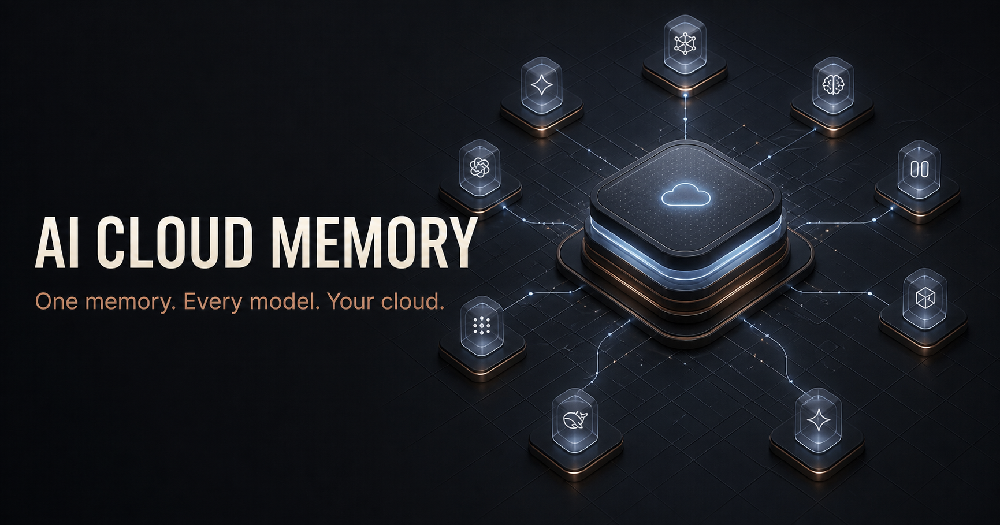

# AI Cloud Memory Community Edition

Your own shared memory, project board and long-term roadmap for AI clients, running in your Cloudflare account and owned through your GitHub identity.

[](https://deploy.workers.cloudflare.com/?url=https://github.com/DrewMauldin/AI-Cloud-Memory)
[](https://github.com/DrewMauldin/AI-Cloud-Memory/actions/workflows/ci.yml)
[](LICENSE)



AI Cloud Memory gives Codex, Claude Code, OpenCode and compatible web clients one authenticated MCP endpoint for durable memory and project lifecycle work. D1 is canonical. Search works in lexical and temporal mode by default, while Vectorize and Workers AI can be enabled later for semantic retrieval and reranking.

> No n8n, home server, vendor account or service operated by this project is required. Each adopter deploys an isolated copy to their own Cloudflare and GitHub accounts.

## What you get

- Owner-only GitHub OAuth and scoped MCP OAuth
- Memories and standing directives with provenance, labels, archive, supersession and review
- Projects, Kanban tasks, completion receipts, archived work and Done history
- Longer-term project roadmaps with safe promotion into tasks
- Temporal query handling, bounded ranking boosts and semantic deduplication
- Explainable search results and a private relevance benchmark
- Managed Obsidian Markdown projection and portable encrypted exports
- Responsive dashboard designed for desktop and mobile Safari
- 24 narrowly scoped `cloudmemory_*` MCP tools
- Optional connectors and automation credentials, without making an automation platform a dependency

## Architecture

```text
Codex · Claude · OpenCode · compatible web clients
                         │
                 OAuth-protected MCP
                         │
             Cloudflare Worker + dashboard
                ┌────────┼────────┐
                │        │        │
               D1       KV    Static assets
           canonical   OAuth      UI
                │
       optional derived services
       Vectorize · Workers AI
                │
       optional encrypted export
             your GitHub repo
```

The Worker, database, OAuth state and optional AI index belong to the adopter. The public project has no central memory service and no access to deployed instances. See [Architecture](docs/ARCHITECTURE.md) and [Privacy](docs/PRIVACY.md).

## Deploy

### 1. Create your copy

Use the Deploy to Cloudflare button above. Cloudflare can create a GitHub copy and provision supported Worker bindings from `wrangler.jsonc`.

If automatic Vectorize provisioning is unavailable in your account, create the optional index before enabling semantic search:

```bash
npx wrangler vectorize create ai-cloud-memory --dimensions=768 --metric=cosine
```

Keep `SEMANTIC_SEARCH_ENABLED=false` until that index exists. The base product does not call Workers AI or Vectorize in this mode.

### 2. Choose the final URL

Use the generated `workers.dev` origin or attach your final custom domain. Record the exact HTTPS origin without a trailing slash, for example:

```text
https://ai-cloud-memory.your-subdomain.workers.dev
```

Set `PUBLIC_ORIGIN` to that origin. `auto` is useful only during initial deployment. Setting the final origin before creating GitHub OAuth avoids a second OAuth callback migration.

### 3. Create a GitHub OAuth App

In GitHub, open **Settings → Developer settings → OAuth Apps → New OAuth App**.

| Field | Value |
|---|---|
| Application name | AI Cloud Memory |
| Homepage URL | `https://your-final-origin.example` |
| Authorisation callback URL | `https://your-final-origin.example/callback` |

Record the client ID and generate a client secret. Never commit the secret.

### 4. Configure the owner lock

Set these non-secret Worker variables in `wrangler.jsonc` or the Cloudflare dashboard:

```text
ALLOWED_GITHUB_USER_ID=your numeric GitHub user ID
ALLOWED_GITHUB_LOGIN=your GitHub login
PUBLIC_ORIGIN=https://your-final-origin.example
SEMANTIC_SEARCH_ENABLED=false
```

The numeric user ID is the immutable security boundary; the login is display metadata. Set the secrets from a trusted terminal:

```bash
npx wrangler secret put GITHUB_CLIENT_ID
npx wrangler secret put GITHUB_CLIENT_SECRET
openssl rand -hex 32 | npx wrangler secret put COOKIE_ENCRYPTION_KEY
```

### 5. Migrate and deploy

```bash
npm ci
npm run check
npm run deploy
```

The deploy command intentionally publishes twice on a fresh account: the first pass lets Cloudflare auto-provision declared resources, migrations then initialise D1, and the final pass becomes the verified application release. The placeholder owner lock keeps the bootstrap deployment inaccessible until you replace it.

Then open `/setup.html` on your deployed origin for the local, browser-only checklist. Full instructions are in [Deployment](docs/DEPLOYMENT.md) and [Onboarding](docs/ONBOARDING.md).

## Connect an AI client

Your remote MCP endpoint is:

```text
https://your-final-origin.example/mcp
```

Common native clients:

```bash
# Codex
codex mcp add cloud-memory --url https://your-final-origin.example/mcp

# Claude Code
claude mcp add --transport http cloud-memory https://your-final-origin.example/mcp
```

OpenCode can use a remote MCP entry in `opencode.json`:

```json
{
  "mcp": {
    "cloud-memory": {
      "type": "remote",
      "url": "https://your-final-origin.example/mcp",
      "enabled": true
    }
  }
}
```

Complete OAuth separately in every client. Verify `cloudmemory_health`, `cloudmemory_board`, a harmless search and one explicitly approved write. Web-client capabilities and plan restrictions vary. See [Client setup](docs/CLIENTS.md).

## Required and optional services

| Capability | Default | Service |
|---|---:|---|
| Worker, dashboard and MCP | Required | Cloudflare Workers |
| Canonical data | Required | Cloudflare D1 |
| OAuth state | Required | Cloudflare KV |
| Owner identity | Required | GitHub OAuth |
| Semantic search and reranking | Off | Vectorize + Workers AI |
| Encrypted repository backups | Off | Your GitHub repository |
| Obsidian delivery | Off | Any compatible WebDAV automation |
| n8n | Never required | Optional third-party automation |

Cloudflare’s limits and pricing can change. Check the current [Workers pricing](https://developers.cloudflare.com/workers/platform/pricing/), [D1 pricing](https://developers.cloudflare.com/d1/platform/pricing/), [Vectorize pricing](https://developers.cloudflare.com/vectorize/platform/pricing/) and [Workers AI pricing](https://developers.cloudflare.com/workers-ai/platform/pricing/) before enabling optional services. This project does not enable paid usage or billing on your behalf.

## Semantic search

The safe default is lexical-only:

```text
SEMANTIC_SEARCH_ENABLED=false
```

New memories remain canonical in D1 with a pending vector state. When you set the variable to `true`, deploy, then choose **Repair index** in Settings, Cloud Memory backfills vectors in bounded batches. The configured BGE model uses a 768-dimensional cosine index. See [Semantic search](docs/SEMANTIC-SEARCH.md).

## Backups and recovery

The dashboard can create an encrypted download without a GitHub token. Optional GitHub delivery needs:

- `EXPORT_ENCRYPTION_KEY`, retained somewhere safe outside the repository
- `GITHUB_EXPORT_TOKEN`, a fine-grained token scoped to Contents access on one backup repository
- `GITHUB_EXPORT_REPOSITORY`, in `owner/repository` form

Losing the encryption key makes existing encrypted exports unrecoverable. D1 remains canonical; Obsidian and GitHub outputs are projections and recovery artefacts, not concurrent writers.

## Local development

Requires Node.js 22.12 or newer.

```bash
npm ci
npm run dev
npm run check
```

The complete check runs repository safety validation, deployment-template validation, lint, type checking, unit tests, Worker/D1 tests and a production build.

## Project governance

- [Security policy](SECURITY.md)
- [Contributing](CONTRIBUTING.md)
- [Support](SUPPORT.md)
- [Code of Conduct](CODE_OF_CONDUCT.md)
- [Changelog](CHANGELOG.md)

Codex Cloud automated review is not part of AI Cloud Memory. Maintainers may connect this GitHub repository to a Codex Cloud environment as external repository administration; no review agent, token or feature is shipped in the product.

## Licence

[MIT](LICENSE). Cloudflare, GitHub, Claude, ChatGPT, Codex, OpenCode, Obsidian and n8n are trademarks of their respective owners and are not affiliated with this project.

## Marketing and discoverability

The repository-local [marketing and discoverability plan](docs/marketing/README.md) contains recommendation-only positioning, claim guardrails, research sources, launch gates and the prioritised backlog.
